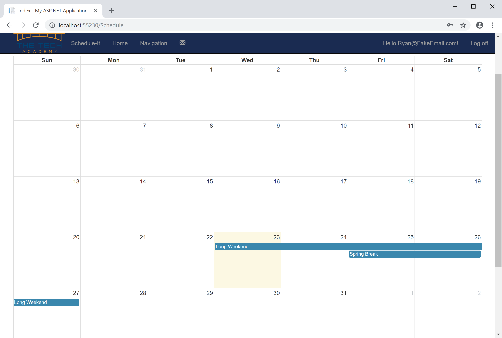

# Live Project
## Introduction
 
One of the most beneficial projects that I worked on at the Tech Academy was the Live Project where I worked with a team of about 8 students.  The project I worked on was an employee tracking system.  The application allows users to clock in and out, set and view schedules, request time off, and provides a simple messaging capablity between administrators and employees.  The development team used Github to track changes to the application which was built using ASP.NET MVC C# with a code first Entity Framework Database.  The UI is bootstrap 3 with calendars based on the FullCalendar Library.  

This application was a work in progress being built by students with many of the features not implemented.  The project was managed under the Agile methodology using Dev Ops.  I was responsible for choosing User Stories to work on from the Product Backlog.  Daily stand ups were held on Google Hangouts which accommodated remote students.  I worked on this project remotely as the main office was in Portland, OR while I was in Colorado.  I used Slack to communicate with the project team members.

This project was run in a real dev environment so students could experience what it is like working on a real world software project.  As a project team member I was responsible for setting up my development environment in Visual Studio, downloading the code to my local machine, and getting the application up and running.  At the beginning of the project I worked on several stories which involved small changes such as modifying the UI and database this allowed me to become familiar with the code base and structure.  As we got further into the project the stories were more involved.  Working on these stories regardless of the level of difficulty helped develop research skills to further my understanding of the languages, frameworks and concepts I have been learning throughout the bootcamp.    

## Story Summaries
* [Update Message/Inbox View](#update-messageinbox-view)  
* [Update Message/Delete View](#update-messagedelete-view)  
* [Update Schedule/Template View](#update-scheduletemplate-view)  
* [Message Model: Update EventID Field and Seed Data](#message-model-update-eventid-field-and-seed-data)  
* [Message/Inbox Accessibility Update](#messageinbox-accessibility-update)  
* [Update Schedule/Create View Modal](#update-schedulecreate-view-modal)  
* [Create AdminError Message](#create-adminerror-message)  
* [Update MessageController Create method](#update-messagecontroller-create-method)  
* [WorkTimeEvent Clock In/Out Functionality](#worktimeevent-clock-inout-functionality)  
* [ScheduleController Bug Fix](#schedulecontroller-bug-fix)  
* [Update Schedule/Index View with User Work Schedules](#update-scheduleindex-view-with-user-work-schedules)  


### Update Message/Inbox View
Below the Unread Message column was removed from the Message/Inbox view in the 'After' code snippet.

**Before:**
```
<table class="table">
    <tr>
        <th>
            @Html.DisplayNameFor(model => model.DateSent)
        </th>
        <th>
            @Html.DisplayNameFor(model => model.DateRead)
        </th>
        <th>
            @Html.DisplayNameFor(model => model.MessageTitle)
        </th>
       <th>
            @Html.DisplayNameFor(model => model.UnreadMessage)
        </th>
        <th></th>
    </tr>
 ```   
    
**After:**
```
<table class="table">
    <tr>
        <th>
            @Html.DisplayNameFor(model => model.DateSent)
        </th>
        <th>
            @Html.DisplayNameFor(model => model.DateRead)
        </th>
        <th>
            @Html.DisplayNameFor(model => model.MessageTitle)
        </th>
        <th></th>
    </tr>
```
Back to [Story Summaries](#story-summaries)

### Update Message/Delete View

The Unread Message column has been removed from the Delete view.

```
<h4>Message</h4>
    <hr />
    <dl class="dl-horizontal">
        <dt>
            @Html.DisplayNameFor(model => model.DateSent)
        </dt>
        <dd>
            @Html.DisplayFor(model => model.DateSent)
        </dd>
        <dt>
            @Html.DisplayNameFor(model => model.DateRead)
        </dt>
        <dd>
            @Html.DisplayFor(model => model.DateRead)
        </dd>
        <dt>
            @Html.DisplayNameFor(model => model.MessageTitle)
        </dt>
        <dd>
            @Html.DisplayFor(model => model.MessageTitle)
        </dd>
        <dt>
            @Html.DisplayNameFor(model => model.Content)
        </dt>
        <dd>
            @Html.DisplayFor(model => model.Content)
        </dd>
    </dl>
```
Back to [Story Summaries](#story-summaries)

### Update Schedule/Template View
Below the 'Details' link was removed from the ScheduleTemplate / Index view.

**Before:**
```
@foreach (var item in Model) {
    <tr>
        <td>
            @Html.DisplayFor(modelItem => item.Notes)
        </td>
        <td>
            @Html.ActionLink("Edit", "Edit", new { id=item.Id }) |
            @Html.ActionLink("Delete", "Delete", new { id=item.Id })
            @Html.ActionLink("Details", "Details", new { id=item.Id })
        </td>
    </tr>
}
```
**After:**
```
@foreach (var item in Model) {
    <tr>
        <td>
            @Html.DisplayFor(modelItem => item.Notes)
        </td>
        <td>
            @Html.ActionLink("Edit", "Edit", new { id=item.Id }) |
            @Html.ActionLink("Delete", "Delete", new { id=item.Id })
        </td>
    </tr>
}
```
Back to [Story Summaries](#story-summaries)

### Message Model: Update EventID Field and Seed Data
The EventID field in the Message model needs to be Nullable because a Message may not have an event associated with it.  

**Before:**
```
public class Message
    {
        [Key]
        public Guid MessageID { get; set; }
        [Display(Name = "Date Sent")]
        public DateTime DateSent { get; set; }
        [Display(Name = "Date Read")]
        public DateTime? DateRead { get; set; }
        [Display(Name = "Message Title")]
        public string MessageTitle { get; set; }
        public string Content { get; set; }
        public ApplicationUser Sender { get; set; }
        public ApplicationUser Recipient { get; set; }
        public Guid EventID { get; set; }
        public List<string> RecipiantList { get; set; }
    }
```
**After:**
```
        public ApplicationUser Recipient { get; set; }
        public Guid? EventID { get; set; }
        public List<string> RecipiantList { get; set; }
```

Below is the portion of the Seed data in the Configuration file where the EventID was being initialized with a New Guid.  The Seed data was changed to initialize the EventID to a null value to accommodate the change made in the Message model.

**Before:**
```
  if (!context.Messages.Any(e => e.Sender == context.Users.Where(u => u.UserName == "Ryan@FakeEmail.com").FirstOrDefault()))
  {
      var messages = new List<Message>();
      messages.Add(new Message()
      {
          MessageID = Guid.NewGuid(),
          DateSent = new DateTime(2018, 12, 1, 13, 30, 0),
          DateRead = new DateTime(2018, 12, 1, 14, 30, 0),
          MessageTitle = "Important Message",
          Content = "Thank you for reading this important message!",
          //UnreadMessage = false,
          Sender = context.Users.Where(u => u.UserName == "Ryan@FakeEmail.com").FirstOrDefault(),
          Recipient = context.Users.Where(u => u.UserName == "John@FakeEmail.com").FirstOrDefault(),
          EventID = Guid.NewGuid()
          ...
      {
          MessageID = Guid.NewGuid(),
          DateSent = new DateTime(2018, 12, 3, 9, 0, 0),
          DateRead = null,
          MessageTitle = "Tasks for Today",
          Content = "Good Morning! The tasks for the day have been posted on the Azure Dev Ops site. Have fun!",
          Sender = context.Users.Where(u => u.UserName == "Matt@FakeEmail.com").FirstOrDefault(),
          Recipient = context.Users.Where(u => u.UserName == "Maricella@FakeEmail.com").FirstOrDefault(),
          EventID = Guid.NewGuid()
      });

      context.Messages.AddRange(messages);
  }
  context.SaveChanges();
}
```
**After:**
```
if (!context.Messages.Any(e => e.Sender == context.Users.Where(u => u.UserName == "Ryan@FakeEmail.com").FirstOrDefault()))
            {
                var messages = new List<Message>();
                messages.Add(new Message()
                {
                    MessageID = Guid.NewGuid(),
                    DateSent = new DateTime(2018, 12, 1, 13, 30, 0),
                    DateRead = new DateTime(2018, 12, 1, 14, 30, 0),
                    MessageTitle = "Important Message",
                    Content = "Thank you for reading this important message!",
                    //UnreadMessage = false,
                    Sender = context.Users.Where(u => u.UserName == "Ryan@FakeEmail.com").FirstOrDefault(),
                    Recipient = context.Users.Where(u => u.UserName == "John@FakeEmail.com").FirstOrDefault(),
                    EventID = null
                });
                ...
                messages.Add(new Message()
                {
                    MessageID = Guid.NewGuid(),
                    DateSent = new DateTime(2018, 12, 3, 9, 0, 0),
                    DateRead = null,
                    MessageTitle = "Tasks for Today",
                    Content = "Good Morning! The tasks for the day have been posted on the Azure Dev Ops site. Have fun!",
                    Sender = context.Users.Where(u => u.UserName == "Matt@FakeEmail.com").FirstOrDefault(),
                    Recipient = context.Users.Where(u => u.UserName == "Maricella@FakeEmail.com").FirstOrDefault(),
                    EventID = null
                });

                context.Messages.AddRange(messages);
            }
            context.SaveChanges();
           }
 ```
 
To implement the changes made to the Message model I created the following migration files through the Nuget Package Manager => Package Manager Console screen. The add-migration command prompts for a file name, the migration files are auto-generated and the update-database command applies the changes to the database.
 
**Migration Files Created:**
*201901102056180_MsgEventIdNullble.cs*
```
namespace ScheduleIt2.Migrations
{
    using System;
    using System.Data.Entity.Migrations;
    
    public partial class MsgEventIdNullble : DbMigration
    {
        public override void Up()
        {
            AlterColumn("dbo.Messages", "EventID", c => c.Guid());
        }
        
        public override void Down()
        {
            AlterColumn("dbo.Messages", "EventID", c => c.Guid(nullable: false));
        }
    }
}
```

*201901102056180_MsgEventIdNullble.Designer.cs*
```
// <auto-generated />
namespace ScheduleIt2.Migrations
{
    using System.CodeDom.Compiler;
    using System.Data.Entity.Migrations;
    using System.Data.Entity.Migrations.Infrastructure;
    using System.Resources;
    
    [GeneratedCode("EntityFramework.Migrations", "6.2.0-61023")]
    public sealed partial class MsgEventIdNullble : IMigrationMetadata
    {
        private readonly ResourceManager Resources = new ResourceManager(typeof(MsgEventIdNullble));
        
        string IMigrationMetadata.Id
        {
            get { return "201901102056180_MsgEventIdNullble"; }
        }
        
        string IMigrationMetadata.Source
        {
            get { return null; }
        }
        
        string IMigrationMetadata.Target
        {
            get { return Resources.GetString("Target"); }
        }
    }
}
```

Also auto generated: *201901102056180_MsgEventIdNullble.resx*  
Back to [Story Summaries](#story-summaries)

### Message/Inbox Accessibility Update
The Message/Inbox view should only be accessible for users who are logged in.  As an ApplicationUser object the User is confirmed as authenticated via IsAuthenticated property in the Asp.Net Identity system.

**Before:**
 ```
public ActionResult Inbox()
{
 return View(db.Messages.Where(m => m.Recipient == db.Users.Where(u => u.UserName == User.Identity.Name).FirstOrDefault()).ToList());
}
  ```
**After:**
```
// GET: Message/Inbox
public ActionResult Inbox()
{
  if (User.Identity.IsAuthenticated)
  {
    return View(db.Messages.Where(m => m.Recipient == db.Users.Where(u => u.UserName == User.Identity.Name).FirstOrDefault()).ToList());
  }
  else return View("LoginError");
 }
```
Back to [Story Summaries](#story-summaries)

### Update Schedule/Create View Modal

Text was added to the Schedule/Create input screen to specify the date format to be used which is MM/DD/YYYY.  Once this was completed the code was tested to verify that the date being input was being accepted by the datetime object.

```
<div class="form-group">
    @Html.LabelFor(model => model.ScheduleStartDay, htmlAttributes: new { @class = "control-label col-md-4" })
 <div class="col-md-8">
    @Html.EditorFor(model => model.ScheduleStartDay, new { htmlAttributes = new { @class = "form-control" } })
    @Html.ValidationMessageFor(model => model.ScheduleStartDay, "", new { @class = "text-danger" })
     <p>MM/DD/YYYY</p>
 </div>
</div>
<div class="form-group">
  @Html.LabelFor(model => model.ScheduleEndDay, htmlAttributes: new { @class = "control-label col-md-4" })
<div class="col-md-8">
  @Html.EditorFor(model => model.ScheduleEndDay, new { htmlAttributes = new { @class = "form-control"} })
   @Html.ValidationMessageFor(model => model.ScheduleEndDay, "", new { @class = "text-danger" })
     <p>MM/DD/YYYY</p>
  </div>
 ```
 
 
 
 
 Back to [Story Summaries](#story-summaries)
 
### Create AdminError Message
 
Created a new AdminError page inside of the Views/Shared folder displaying the message that the user must be an admin to view the page. 
 
```
@model System.Web.Mvc.HandleErrorInfo
@{
    ViewBag.Title = "Admin Error";
}
<hgroup>
    <h1 class="text-danger">Error:</h1>
    <h2 class="text-danger">You must be an Administrator to view this page.</h2>
</hgroup>
```
Back to [Story Summaries](#story-summaries)

### Update MessageController Create method

The Create method in the MessageController was updated to set the Sender property to whomever is currently logged in.  I got the current User from the HttpContext and accessed the GetUserId method in order to set the Sender Id to the user currently logged in.

**Before:**
```
if (ModelState.IsValid)
{
    message.DateSent = DateTime.Now;
    message.MessageId = Guid.NewGuid();
    db.Messages.Add(message);
    db.SaveChanges();
    return RedirectToAction("Index");
}
```

**After:**
```
if (ModelState.IsValid)
{
    message.DateSent = DateTime.Now;
    message.MessageID = Guid.NewGuid();
    //Set the Sender property to whomever is logged in
    message.Sender.Id = HttpContext.User.Identity.GetUserId();
    db.Messages.Add(message);
    db.SaveChanges();
    return RedirectToAction("Index");
}
```
Back to [Story Summaries](#story-summaries)

### WorkTimeEvent Clock In/Out Functionality

The Clock button on the Home screen did not have any functionality and the WorkTimeEvents flow had not been determined, this was something I helped define as I worked on this story.   I added a Url.Action parameter to the 'Clock' button tag redirecting the user to the WorkTimeEvents Index view and creating a WorkTimeEvent object.   If the user was not logged in they would first get directed to the Login screen and then taken to the WorkTimeEvents Index screen.  

The WorkTimeEvents Index screen was displaying events for the Admin view however the User View functionality was not operational.  I updated the WorkTimeEventController Index method to query the database for all WorkTimeEvents if an Admin was currently logged in otherwise the database was queried for  current user's WorkTimeEvents and ordered by date.  The results were displayed on the WorkTimeEvents/Index view.

The Create method in the WorkTimeEventsController was not functioning.  I utililized the logic in an existing ClockToggle method which was not being called to modify the Create method.  The updated Create method queried the database to determine if the user was Clocked In.  If the user was not already Clocked In the ScheduleStartDate was set to the current datetime and an entry was made to the database.  If a row was found for the current user containing a null end date that row would be updated with the current datetime and the user would be clocked out.

The Create screen was updated to only include inputs for the Title and Notes fields for which the User could input information.  If the user was clocking out and these fields were not null,  any new data entered would be concatenated to the string rather than overwriting the existing information.
 
 Views/Home/Index
 ```
<button id="clockin" 
onclick="location.href='@Url.Action("Index", "WorkTimeEvents", new WorkTimeEvent  {EventId = Guid.NewGuid()})'" class="mt-10">Clock</button><br />
```

Home Screen for the application


WorkTimeEventsController
```
public class WorkTimeEventsController : Controller
{

private ApplicationDbContext db = new ApplicationDbContext();

// GET: WorkTimeEvents
[Authorize]
public ActionResult Index()
{
    var adminQuery = db.WorkTimeEvents.ToList();

    var currentuser = HttpContext.User.Identity.GetUserId();                
    var userQuery = db.WorkTimeEvents
        .Where(x =>
        x.UserId == new Guid(currentuser)               
        ).OrderBy(x => x.Start).ToList();

    //If Admin, display all WorkTimeEvents
    if (User.IsInRole("Admin"))
        return View(adminQuery);
    else
        //If User, display all WorkTimeEvents for current User
        return View(userQuery);           
}

// GET: WorkTimeEvents/Create
public ActionResult Create()
{
    return View();
}

// POST: WorkTimeEvents/Create
// To protect from overposting attacks, please enable the specific properties you want to bind to, for 
// more details see https://go.microsoft.com/fwlink/?LinkId=317598.
[HttpPost]
[ValidateAntiForgeryToken]
public ActionResult Create([Bind(Include = "EventID,Start,End,Note,Title,ActiveSchedule,ApproverId,UserId,ClockFunctionStatus")] WorkTimeEvent workTimeEvent)
{
  var currentuser = HttpContext.User.Identity.GetUserId();
  Guid currentUserId = new Guid(currentuser);         

  // Get all WorkTimeEvents for current user with a null End date
  var workTimeEvents = db.WorkTimeEvents
                .Where(x => x.End == null &&
                x.UserId == currentUserId              
                ).FirstOrDefault();

   if (ModelState.IsValid)
   { 
     if (workTimeEvents != null)
     {
     //Don't overwrite existing info in Title
     if (workTimeEvent.Title != null)
     {
         StringBuilder appendtitle = new StringBuilder();
         appendtitle.Append(workTimeEvents.Title).Append(", ").Append(workTimeEvent.Title);
         workTimeEvents.Title = appendtitle.ToString();
     }

     //Don't overwrite existing info in Note
     if (workTimeEvent.Note != null)
    {
        StringBuilder appendnote = new StringBuilder();
        appendnote.Append(workTimeEvents.Note).Append(", ").Append(workTimeEvent.Note);
        workTimeEvents.Note = appendnote.ToString();
     }

      workTimeEvents.End = DateTime.Now;
      workTimeEvents.ClockFunctionStatus = ClockFunctionStatus.ClockOutSuccess;

      db.Entry(workTimeEvents).State = EntityState.Modified;
      db.SaveChanges();
     }
     else
    {
      workTimeEvent.EventId = Guid.NewGuid();
      workTimeEvent.Start = DateTime.Now;              
      workTimeEvent.End = null;
      workTimeEvent.UserId = currentUserId;
      workTimeEvent.ClockFunctionStatus = ClockFunctionStatus.ClockInSuccess;
      db.WorkTimeEvents.Add(workTimeEvent);

      db.SaveChanges();
    };
       return RedirectToAction("Index");
    }
       return View(workTimeEvent);
    }
```

Index View for an Admin listing WorkTimeEvents for all users


Index View for a User listing WorkTimeEvents for the current user ordered by start date


Views/WorkTimeEvents/Create
```
<h2>Clock In/Out</h2>

@using (Html.BeginForm())
{
    @Html.AntiForgeryToken()
<div class="form-horizontal">  
    <hr />
    @Html.ValidationSummary(true, "", new { @class = "text-danger" })
    <div class="form-group">
        @Html.LabelFor(model => model.Title, htmlAttributes: new { @class = "control-label col-md-2" })
        <div class="col-md-10">
            @Html.EditorFor(model => model.Title, new { htmlAttributes = new { @class = "form-control" } })
            @Html.ValidationMessageFor(model => model.Title, "", new { @class = "text-danger" })
        </div>
    </div>

    <div class="form-group">
        @Html.LabelFor(model => model.Note, htmlAttributes: new { @class = "control-label col-md-2" })
        <div class="col-md-10">
            @Html.EditorFor(model => model.Note, new { htmlAttributes = new { @class = "form-control" } })
            @Html.ValidationMessageFor(model => model.Note, "", new { @class = "text-danger" })
        </div>
    </div>

    <div class="form-group">
        <div class="col-md-offset-2 col-md-10">
            <input type="submit" value="Clock In/Out" class="btn btn-default" />
        </div>
    </div>
</div>
}
```

WorkTimeEvents Create View before updates were made


WorkTimeEvents Create View after updates were made


Back to [Story Summaries](#story-summaries)

### ScheduleController Bug Fix

An error was being thrown when the Create button was clicked from the Schedule page.  I determined the ScheduleId field, which was a primary key, was not being set therefore an error was being thrown.  The fix was simply to set the ScheduleId field to a new Guid.

ScheduleController
```
public ActionResult Create([Bind(Include = "ID,Notes,ScheduleStartDay,ScheduleEndDay,UserId,Repeating,TemplateId")] Schedule schedule)
{
  if (ModelState.IsValid)
  {            
      schedule.ScheduleId = Guid.NewGuid();
      schedule.UserId = HttpContext.User.Identity.GetUserId();
      db.Schedules.Add(schedule);
      db.SaveChanges();
      return RedirectToAction("Index");
  }
  return View(schedule);           
}
```
Back to [Story Summaries](#story-summaries)

### Update Schedule/Index View with User Work Schedules

The current Schedule/Index page was a report showing Notes, Start Date, End Date and UserId.  The purpose of this story was to remove the existing report and replace it with a full calendar that displays events for all users showing when they will be working.  For this story the ScheduleConroller passes a serialized list of Schedule data to a JavaScript function.  The list is parsed and passed on to the fullCalendar method.  Events are displayed as a block on the calendar based on the start day and end day and any Notes entered are also displayed.  

ScheduleController
```
// GET: Schedule
//public ActionResult Index()
public async Task<ActionResult> Index()
{
   var query = await db.Schedules.ToListAsync();
   ViewBag.Query = new JavaScriptSerializer().Serialize(query);
   return View();
}
```

Scripts/Site.js
```
//Schedule/Index calendar 
$(function () {
    //render calendar in view
    $('#scheduleCalendar').fullCalendar({
        displayEventEnd: true,
        eventLimit: true,
        displayEventTime: false
    })
    //JSON request to pull data from Schedule table, write to list and send to calendar.
    let viewList = []
    let queryList = JSON.parse($('#scheduleData').val()); 

    for (let x of queryList) {      
        viewList.push({
            title: x.Notes,
            start: moment(x.ScheduleStartDay),
            end: moment(x.ScheduleEndDay)          
        });
        }         
    $('#scheduleCalendar').fullCalendar('renderEvents', viewList);
})
```

Views/Schedule/Index
```
@model IEnumerable<Schedule_It_2.Models.Schedule>
@{
    ViewBag.Title = "Index";
}
<h2>Index</h2>
<p>
    @Html.ActionLink("Create New", "Create")
</p>
@{
    var query = ViewBag.Query;
    var queryJSON = Html.Raw(query);
}
<!--input holds c# data for JS to use-->
<input id="scheduleData" type="hidden" value='@queryJSON' />
<div id="scheduleCalendar">
</div>
```




Back to [Story Summaries](#story-summaries)


